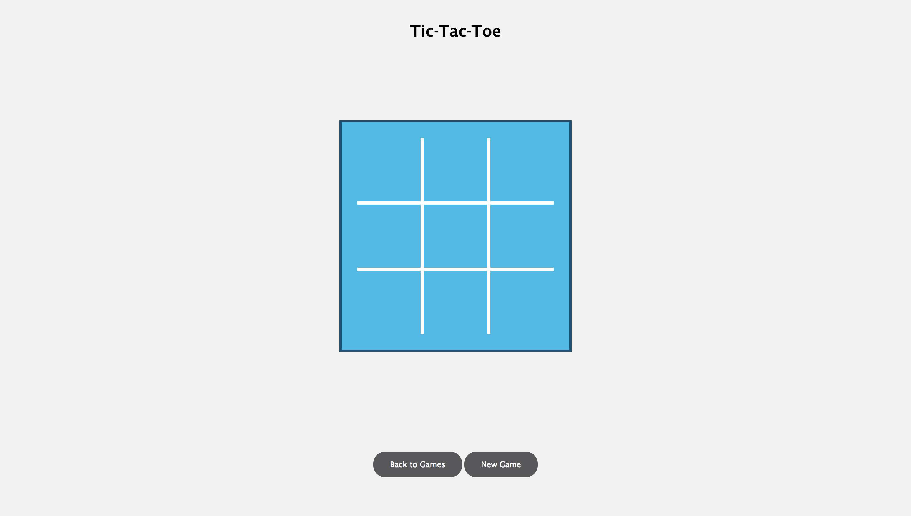
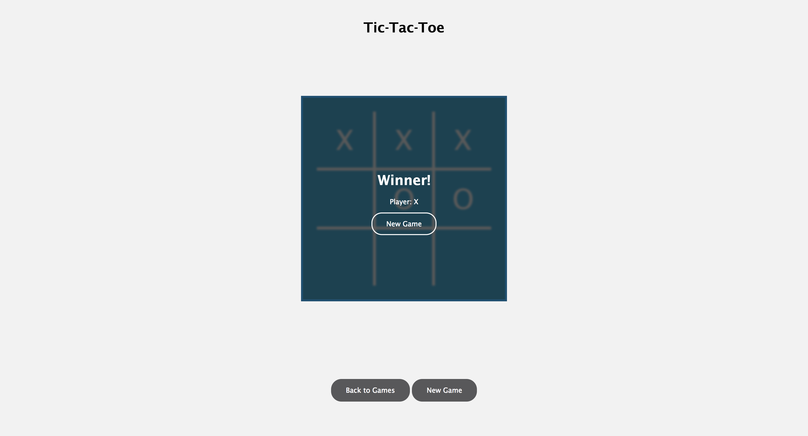

# arcade-angular

This project contains an Angular arcade app where we can build various games for users to play!

## Getting Started

### Prerequsites

1. Install [Git](https://git-scm.com/book/en/v2/Getting-Started-Installing-Git)
2. Install [Node (and NPM)](https://nodejs.org/en/)

### Clone the Repository

```
git clone https://bitbucket.org/pcallen1015/angular-interview-version-a.git
```

### Install Project Dependencies

```
cd angular-interview-version-a/
npm install
```

### Run the App

Start the Angular app

```
npm start
```

The server should start running at `localhost:4200`

---

# The Interview Exercise

## The Objective

The purpose of this exercise is for you to demonstrate your skills working with Angular. The project uses many of the technologies we frequently use to build applications in our team.

## The One Big Rule

**Your work should be your own**

You are welcome to use the resources that would normally be at your disposal (Google, Stackoverflow, Documentation, etc.), but your submission should reflect your own problem solving ability.

DON'T, for example, find an existing solution (if one exists), copy+paste, and submit that as your own work, thinking we won't notice. **We will**.

## The Project Structure

The structure of this project is based on Angular-CLI. If you've used this tool before, the structure should be familiar.

There's additional functionality built into the application. **For the sake of simplicity, we'll focus on what you'll be working on:**

```
src/
  |-- app/
    |-- games/
      |-- tic-tac-toe/
        |-- tic-tac-toe-game/
          |-- tic-tac-toe-game.component.html
          |-- tic-tac-toe-game.component.scss
          |-- tic-tac-toe-game.component.spec.ts
          |-- tic-tac-toe-game.component.ts
        tic-tac-toe.module.ts
  |-- assets/
    |-- sass/
      |-- buttons.scss
      |-- variables.scss

```

#### GamesModule (src/app/games)

Inside `AppModule`, there's a submodule called `GamesModule`. This module houses some components and services useful to all games in our arcade, as well as the game implementations themselves (e.g.: Tic-Tac-Toe).

#### TicTacToeModule (src/app/games/tic-tac-toe)

`TicTacToeModule` is where we'll store our implementation for Tic-Tac-Toe. Any components, services, classes, etc. related to Tic-Tac-Toe should be stored here.

### Assets (src/assets)

In the `assets` directory, you'll find some styling already written that may be useful.

## Tips

1. Documentation - Everybody likes well-documentation code, and it helps understand your thought process.
2. Style and Visuals - We're not imposing specific requirements around visual style. We want to see what you can come up with!
3. Don't be afraid to go "above and beyond." If you have an idea for a cool additional feature, or an improvement to an existing one, or an alternatice design approach, GO FOR IT (once you've completed the required stuff, that is).

---
# THE EXERCISE REQUIREMENTS

## 1. The Game: Tic-Tac-Toe

In `src/app/games/tic-tac-toe`, implement a game of Tic-Tac-Toe.

If you're not familiar with the game, Tic-Tac-Toe is played with two players: Player "X" and Player "O". The players take turns selecting cells on the board (marking their cells with either "X" or "O"), with the objective being to get 3 cells in a row to win the game.

For the purposes of this exercise, you can pretend the game is being played by two people sitting at the same computer, taking turns making moves (you don't have to implement some fancy AI).

### 1a. The Game Board

Start by constructing the game board.

Tic-Tac-Toe is played on a 3x3 grid. Each turn, a player selects one of the 9 "cells" trying to get three in a row to win.

*Hint: Think about how to represent the game board using data, rather than hard-coding the board in the HTML template.*



### 1b. Making Moves

Now that you have a board, implement the logic of letting players select cells.

### 1c. Game Over

Finally, determine when the game is over. This can happen one of two ways:

1. A player successfully claims three cells in a row (somebody won)
2. All nine cells get claimed, but nobody gets three in a row (a draw)

When the game is over, notify the players and allow them to start a new game.



## 2. Tracking Wins

Once we have the game working, it would be nice if we could track who is winning.

**Implement a way to track each won game (i.e.: when a game is won, track (1) what game it was, (2) who won, and (3) the date).**

There are two ways you could approach this:

- If you're also completing the node-interview exercise, you can call the API endpoints from that project and store the wins in a MongoDB database
- If you're just focusing on the Angular side of things (or you'd rather just keep them seperate), you can store the wins in an array somewhere. **BUT, you should build it as if you were sending this data to a database.**

*Hint: There might already be some functionality in the project that could help you here*

## 3. (BONUS) Ideas for Extra Features

1. All the players to enter their names before playing (and even choose a symbol other than "X" or "O")
2. Allow players to specify the size of the grid
    1. Tic-Tac-Toe is played on a 3x3 grid, but the rules of the game still work for a 4x4, 5x5, or even a 10x10 grid.
3. Implement a computer player
4. Build another game!

Feel free to get creative!

## 4. Submission

You're all done!

To submit your solution, send us an [email](mailto:arcade-interview@cisco.com) with the following:

### Your Name

... so we know who you are.

### A Link to Your Code

Create a repository on a service like Github or Bitbucket and provide the link.

**Please don't commit back into this repository! It will be publically accessible and we don't want people stealing your solution!**

### Code Improvements

If you had more time, is there anything you'd do differently (in your code OR in OURS)? What would you do and why?

### Reflection & Feedback

What did you think about this exercise? Did you like it? Did you hate it? Were the instructions clear? Was is too easy? Too hard?